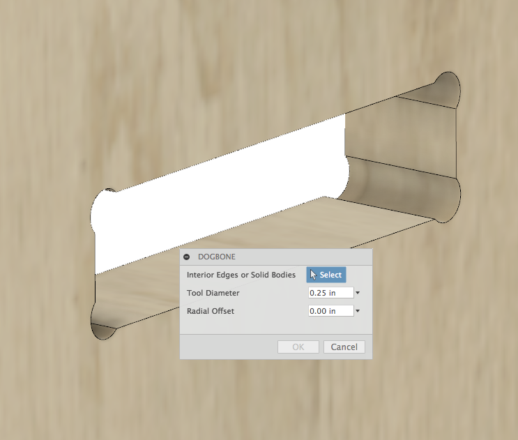

# Dogbone
A Fusion360 addin that creates dogbone joints for wood joinery.

# Installation
[Click here to download the Add-in](https://github.com/tapnair/Dogbone/archive/master.zip)

After downloading the zip file follow the [installation instructions here](https://tapnair.github.io/installation.html) for your particular OS version of Fusion 360 

## Usage:

See a youtube video of using this app here:
http://youtu.be/EM13Dz4Mqnc

## License
Samples are licensed under the terms of the [MIT License](http://opensource.org/licenses/MIT). Please see the [LICENSE](LICENSE) file for full details.

## Written by

Modified by [Patrick Rainsberry](https://twitter.com/prrainsberry)   (Autodesk Fusion 360 Business Development)
Forked from: http://github.com/caseycrogers/Dogbone

See more useful [Fusion 360 Utilities](https://tapnair.github.io/index.html)

